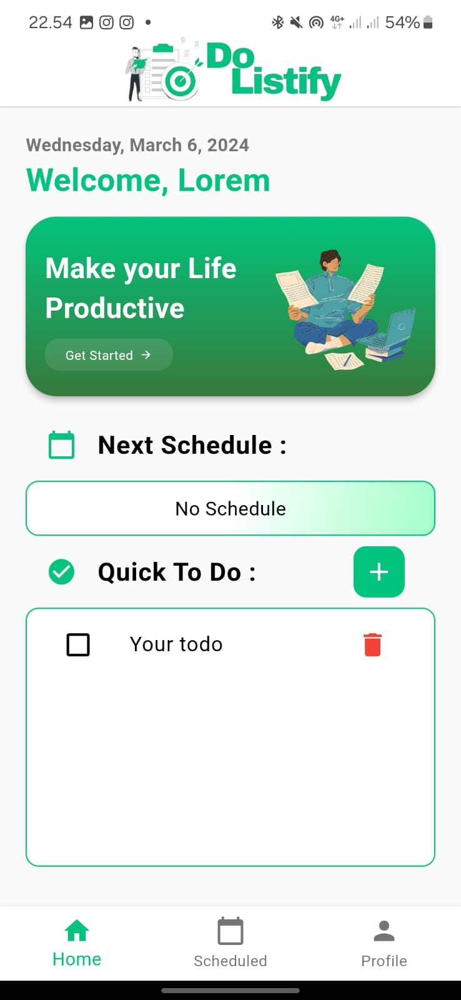
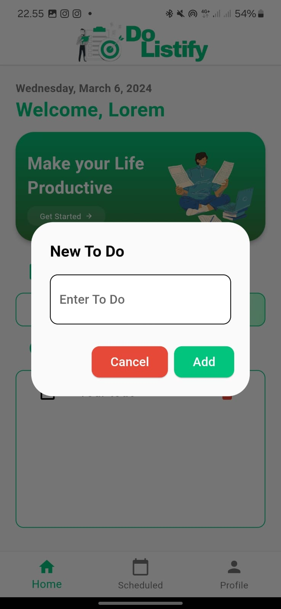
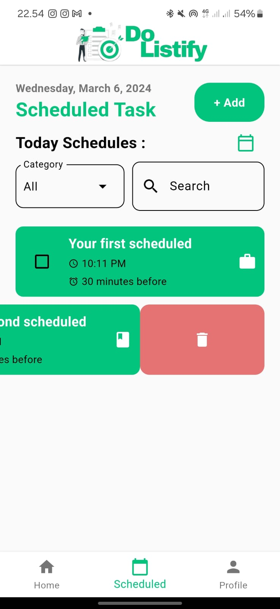
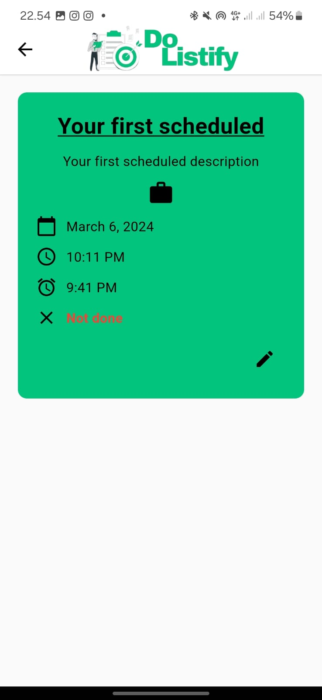
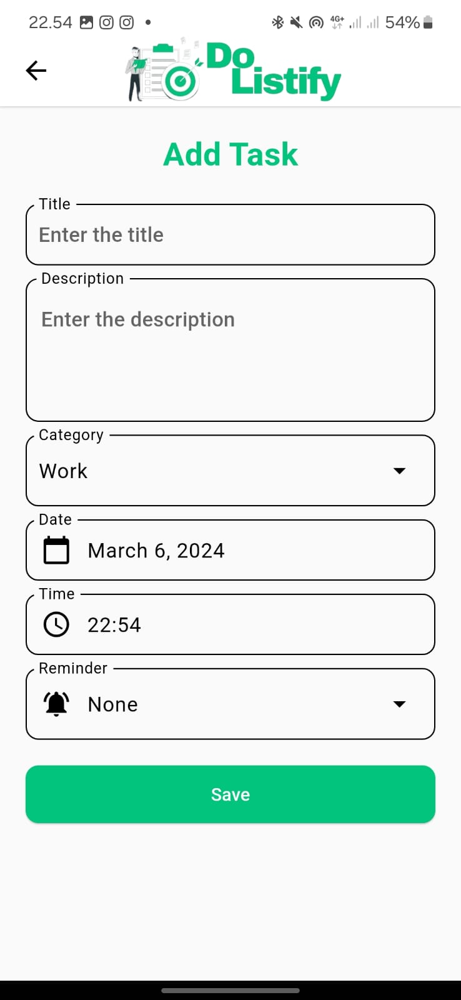
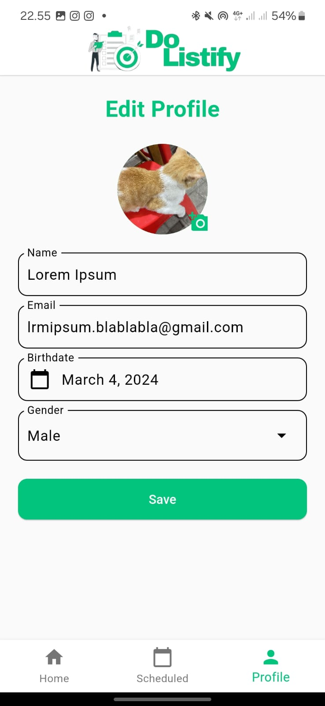
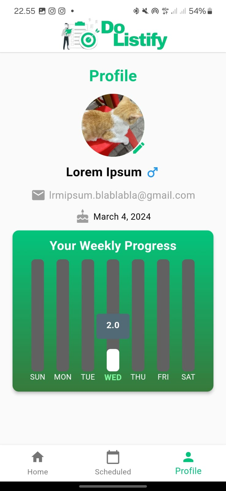

# DoListify 📝🎯✅📋
Ristek Mobile Development Open Recruirement 2024 Personal Task.

  

## Feature
DoListify is a mobile application created with the Flutter framework. This app serves as a task and activity management tool, offering various features to support daily productivity. The app's data is integrated with a local database using the Hive package for efficient management.

### 1. Quick ToDo & Home Page:

This feature allows users to swiftly create ToDo lists for activities they plan to undertake. There also reminder in Homepage for next scheduled task on today.

### 2. Scheduled Task:

Users can record tasks to be completed at specific times. These tasks can be added, edited, and deleted. Additionally, a notification feature is currently under development.

### 3. Profile & Weekly Progress:

Users can create profiles within the app, displaying their weekly progress in task completion on the profile page. This feature provides insights into personal achievements and ongoing tasks throughout the week.

## Dependencies

Dependencies:
- image_picker: Used to capture images from the camera or gallery for the profile feature.
- email_validator: Employed for email input validation within the profile section.
- intl: Utilized for formatting DateTime data types in Flutter.
- google_fonts: Enables the replacement of default fonts with those available on Google Fonts.
- hive & hive_flutter: Non-SQL database management tools for storing application data locally.
- flutter_slidable: Adds swipe/slide actions to widgets, enhancing user interaction.
- fl_chart: Implemented to create charts displaying users' weekly progress.
- awesome_notifications: Utilized for creating reminder notifications for tasks.

Dev Dependencies:
- flutter_launcher_icons: Generate and customize the app icons displayed on a mobile device's home screen.

## Lesson Learned
This is my third project in creating applications using the Flutter framework. The two previous projects were related to the PBP course, involving both individual and group assignments. However, working on this project introduced me to several new aspects of application development. I learned how to integrate data within the application with local storage, and I also focused on writing clean code for analysis in the CI/CD process. Implementing CI/CD during the development of this application was a new learning experience for me. Unfortunately, due to time constraints, I couldn't automate testing for the application. I encountered and learned a lot from various bugs during the development process. However, the current state of the application is not perfect as per my plan, specifically due to challenges with the smooth functioning of the notification feature.